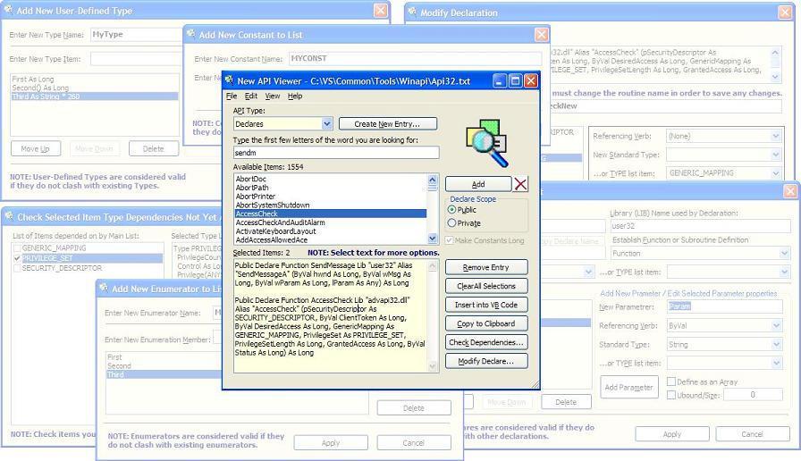



## New API Viewer 1\.0\.3 \(Final\)

### Description

Updated to feature a binary-embedded Manifest and allowed constant lookups to be interactive. This Add-In is a working replacement for the API Viewer that comes with VB6. The New API Viewer comes as a stand-alone executable and as an Add-In to the Visual Basic 6 IDE. Additional features in the New API Viewer that are not in the standard API Viewer: * It gives you the ability to declare dynamically constants as Long in the selected local copy of a constant. This allows the user to keep program speed optimal by not slowing down for variant conversions. Although constants can be of types other than Long, the VB6 API interface uses only Long Integer values for its constants. * It gives you the ability to create new constants right within the viewer. Assigned values are expected to be numeric, as is required by the VB6 API interface, but the values can be declared as hexadecimal, octal, or binary. You can also apply + or - offsets. Constants are created as all-capitals. No complex checks are performed on the value. It simply assumes that you know what you are doing, because such checks can involve complex offsets and naming of other constants. The viewer will also check to ensure that the newly entered constant does not already exist. * It gives you the ability to create new API Declarations right within the viewer and add them to your API list. * It gives you the ability to create new User-Defined Types right within the viewer and add them to your API list. * It gives you the ability to create new Enumerations right within the viewer and add them to your API list. * You can Delete entries from the API list. * It gives you the ability to edit Declared Subroutine and Function parameter lists, and apply these changes to new subroutine or function names (for example, saving a modified version of SendMessage to SendMessageByNum, after changing the lParam as Any to ByVal lParam As Long). The built-in Declaration Editor makes such changes a breeze with just a few clicks of the mouse. * It automatic checks for new parameter dependencies. If an added declaration or user-defined type requires another user-defined type not included in the selection list, you can view the requested types in a dialog and select them or reject them for inclusion in your selection list. This can make resolving declaration headaches such as with the complicated AccessCheck Function, which requires the additional inclusion of the GENERIC_MAPPING, PRIVILAGE_SET, and SECURITY_DESCRIPTOR types. These additional types in turn require the ACL and LUID_AND_ATTRIBUTES types. These newer types in turn also require the LUID type. The New API Viewer makes farming these additional types a breeze with a few quick clicks of the mouse. * Additions created within the New API Viewer can be optionally saved for later re-used in the API data file. New entries are appended to the API file with a date- and time-stamp marker. * It immediate displays updates when you toggle between Private and Public declaration options, define parameters as arrays or fixed-length strings, change a return type, or change the referencing verb (ByRef/ByVal or None). * It includes a copy of and richly expanded freeware API32.TXT by Dan Appleman (president of Desaware, Inc.), which he had derived from the original Win32API.TXT file. On top of that, I have also included several thousand new Constants, Declarations, and Type declarations.
 
### More Info
 

             |
---                |---
**Submitted On**   |2007-05-22 09:35:50
**By**             |[David Ross Goben](https://github.com/Planet-Source-Code/PSCIndex/blob/master/ByAuthor/david-ross-goben.md)
**Level**          |Advanced
**User Rating**    |4.9 (171 globes from 35 users)
**Compatibility**  |VB 6\.0
**Category**       |[Complete Applications](https://github.com/Planet-Source-Code/PSCIndex/blob/master/ByCategory/complete-applications__1-27.md)
**World**          |[Visual Basic](https://github.com/Planet-Source-Code/PSCIndex/blob/master/ByWorld/visual-basic.md)
**Archive File**   |[New\_API\_Vi2067375252007\.zip](https://github.com/Planet-Source-Code/david-ross-goben-new-api-viewer-1-0-3-final__1-68349/archive/master.zip)

